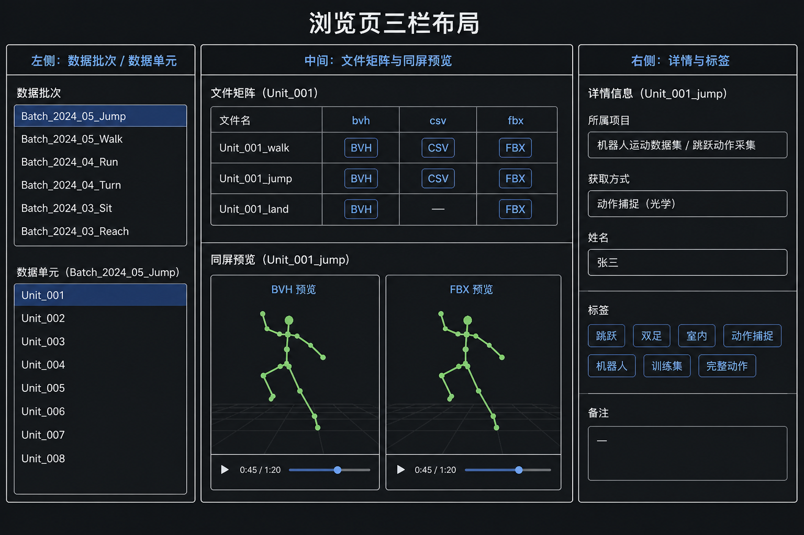
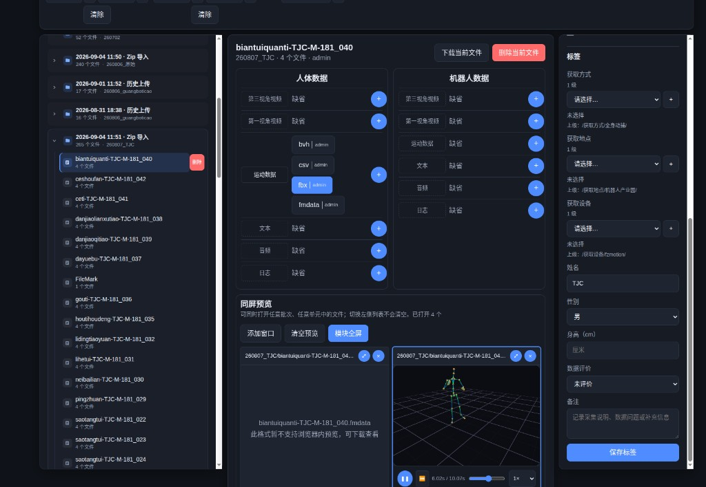

# 超级下载者使用说明

本文只写给角色为 **超级下载者** 的账号。登录后右上角应显示：`你的用户名（超级下载者）`。

你可以浏览全库，并**把任意批次打成 zip 带走**。不能改标签、不能上传。

---

## 你能做什么 / 不能做什么

| 能 | 不能 |
| --- | --- |
| 浏览、筛选、搜索、预览全库 | 改分类或姓名 |
| 下载任意批次 / 单元 / 当前文件 | 上传、删除、管用户 |
| 查看全部 3D 模型 | |

适合需要把全库数据拷走做训练或备份、但不改库的同事。

---

## 登录与菜单

登录后进入 **浏览**。菜单只有 **浏览**、**3D模型管理**。

---

## 查找并预览

1. 用存储结构、所属项目或搜索定位批次/单元。
2. 点 `fbx` / `bvh` / 视频确认内容。
3. 右侧标签只读，用于确认项目、采集方式后再下。

---

## 怎么下载

1. 选中批次或数据单元。
2. 点下载（当前文件，或批次/单元打包）。
3. 勾选需要的本体与模态后确认，等待 zip。
4. 全库或超大批次会较慢，保持页面打开。

---

## 常见问题

**想改标签或上传？**  
当前账号做不到，请联系管理员开通相应权限。

**下到的文件和预览不一致？**  
先点开同一单元里对应格式再下「当前文件」；打整包时核对勾选的模态。
