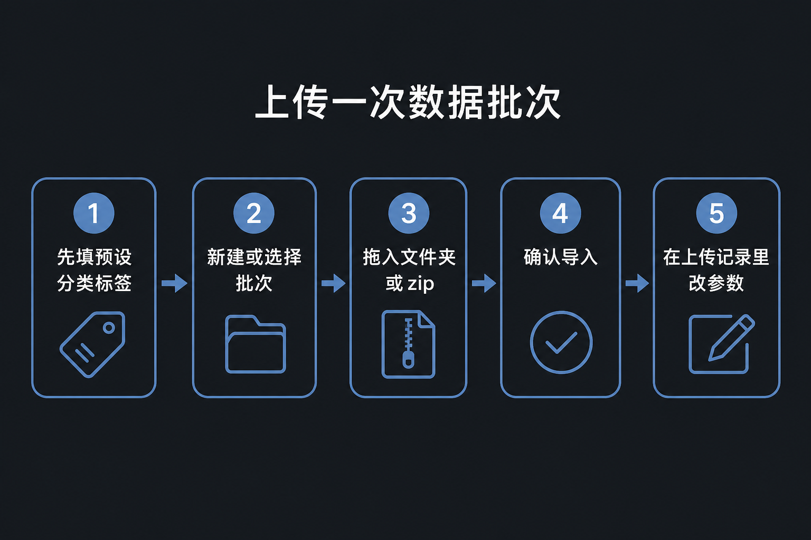
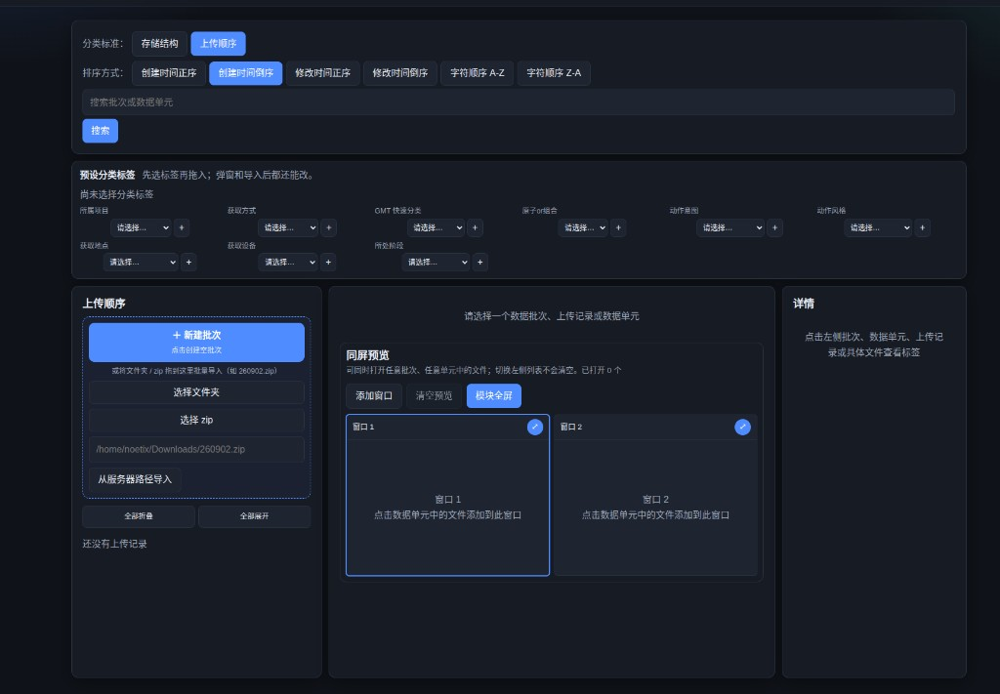
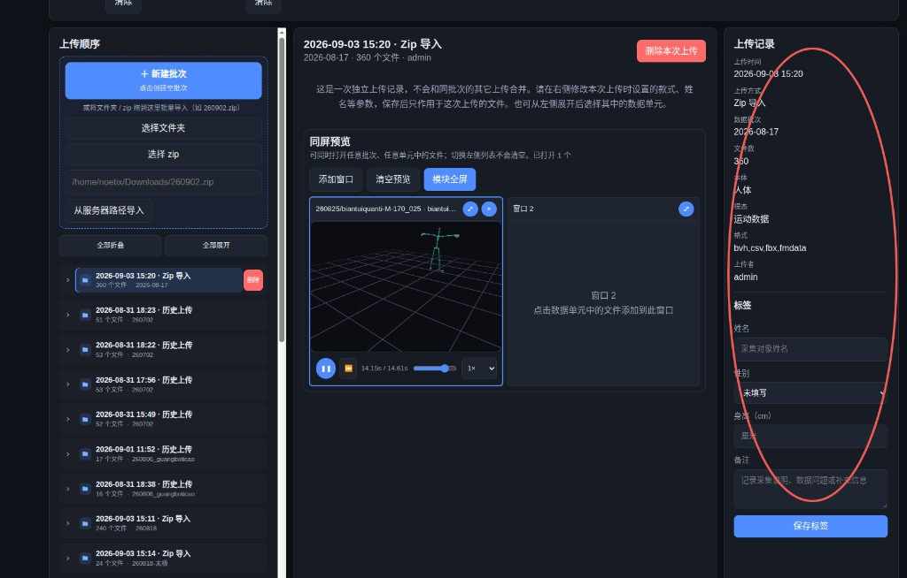

# 超级管理者使用说明

本文只写给角色为 **超级管理者** 的账号。登录后右上角应显示：`你的用户名（超级管理者）`。旧数据里的 `admin` 也按这个角色理解。

你拥有全部菜单和全库权限，并负责**开账号、配范围、用「进入视角」验收**别人实际能看见什么。

对方登录后只会看到自己角色的说明，用「进入视角」即可验收他们实际能看见什么。

---

## 你能做什么

| 能力 | 说明 |
| --- | --- |
| 全库浏览 / 下载 / 标注 / 上传 | 无范围限制 |
| 数据管理 | 删除任意批次、单元、文件，含空批次 |
| 分类管理 | 维护全部分类标准与节点 |
| 3D 模型 | 上传与删除 |
| **用户管理** | 仅你能进：建用户、改角色、启停、删除、配范围、进入视角 |

首次部署默认账号多为 `admin`，密码以现场为准，**上线后立刻修改**。

---

## 登录与菜单

**浏览** · **上传** · **标注** · **数据管理** · **分类管理** · **3D模型管理** · **用户管理**

---

## 1. 给别人开账号（你最重要的工作）

1. 打开 **用户管理**。
2. 底部「新建用户」：用户名、密码、角色，点 **创建**。
3. 选 **普通角色**（游客、下载者、标注者、上传者、管理者）时，在该行点 **配置范围**：
   - 按数据批次路径，例如 `/260807_TJC/`；
   - 或按分类节点，例如所属项目下的「GMT」。
4. 选 **超级角色**（超级游客 … 超级上传者）时不必配范围，创建即可用。
5. 对方登录后会自动看到自己角色的使用说明，也可让他点右上角 **使用说明**。

角色怎么选：

| 对方要做什么 | 建议角色 |
| --- | --- |
| 只看、不改、不下 | 游客 或 超级游客 |
| 要把数据拷走 | 下载者 或 超级下载者 |
| 只补标签 | 标注者 或 超级标注者 |
| 往库里传数据 | 上传者 或 超级上传者 |
| 传完还能删、改分类树 | 管理者（记得配范围） |
| 管人和验收权限 | 只给你自己：超级管理者 |

「普通」= 必须配范围；「超级」= 全库同样能力。只有超级管理者能管理用户。

---

## 2. 进入视角（配完范围必做）

1. 在用户行点 **进入视角**。
2. 顶栏出现正在以某某身份查看；菜单和左侧列表 = 对方登录后的真实情况。
3. 确认他只能看到该看到的项目/批次。
4. 点 **退出视角** 回到你自己的界面。

不要只看配置表，用视角走一遍浏览和上传入口。

---

## 3. 改角色、停用、删除

- 表格里直接改「角色」下拉框。
- **禁用**：不能登录，数据还在。
- **删除**：去掉账号，确认没人再用。

---

## 4. 你自己也会用的业务页

上传、标注、删除、分类树没有范围限制。

- **上传**：预设标签 → 拖 zip/文件夹 → 上传顺序里核对本次参数。
- **标注**：改批次/单元标签会同步到文件。
- **数据管理**：红色删除，不可恢复。
- **分类管理**：改树不影响已打在文件上的旧标签。
- **3D模型管理**：维护人体/机器人实例，供运动预览选款式。

---

## 5. 运维备忘

- 改掉默认密码。
- 护照盘 / NTFS 上大批量导入会慢，等进度结束再关页。
- 浏览走索引，切页应很快；从磁盘直接拷进仓库、未经本站上传的文件，最多约 10 分钟出现在列表里。
- 每个账号登录后只显示该角色自己的说明，互不跳转。

---

## 常见问题

**普通用户说看不见数据？**  
进他的视角核对；检查配置范围是批次路径还是分类节点，是否勾了递归。

**普通管理者能不能开账号？**  
不能。只有你能进用户管理。

**误删数据？**  
系统不提供回收站，只能从备份盘恢复。
