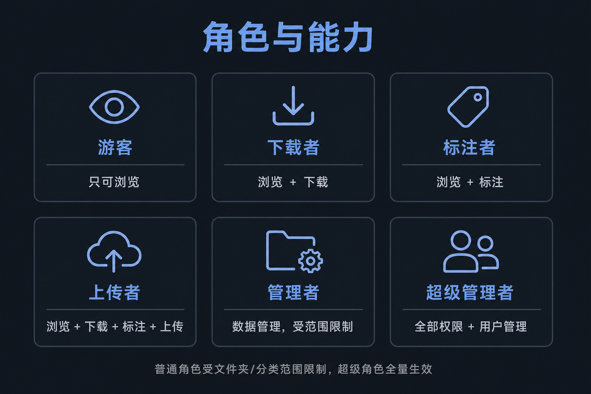

# Noetix Motion Data Hub 使用说明

按**角色**各写了一份，发给谁就打开哪一份，不必读其它角色的章节。

登录页标题是「诺谛动作数据集」，登录后顶栏是 **Noetix Motion Data Hub**。右上角括号里的角色名，和下面文件名一致。

站点里也会显示这些说明：登录成功后自动弹出当前角色的手册，之后可随时点右上角 **使用说明**。

---

## 按角色打开

| 右上角显示 | 说明文档 | 一句话 |
| --- | --- | --- |
| 游客 | [roles/游客.md](roles/游客.md) | 只读看范围内的数据和预览 |
| 超级游客 | [roles/超级游客.md](roles/超级游客.md) | 只读看全库 |
| 下载者 | [roles/下载者.md](roles/下载者.md) | 范围内浏览 + 打包下载 |
| 超级下载者 | [roles/超级下载者.md](roles/超级下载者.md) | 全库浏览 + 打包下载 |
| 标注者 | [roles/标注者.md](roles/标注者.md) | 范围内改分类和姓名等 |
| 超级标注者 | [roles/超级标注者.md](roles/超级标注者.md) | 全库改分类和姓名等 |
| 上传者 | [roles/上传者.md](roles/上传者.md) | 范围内上传、标注、下载 |
| 超级上传者 | [roles/超级上传者.md](roles/超级上传者.md) | 全库上传、标注、下载 |
| 管理者 | [roles/管理者.md](roles/管理者.md) | 范围内还能删除、改分类树 |
| 超级管理者 | [roles/超级管理者.md](roles/超级管理者.md) | 全库 + 用户管理 |

普通角色必须由超级管理者「配置范围」；超级角色全库生效、不用配范围。只有超级管理者能开账号。

---

## 给超级管理者：怎么分发

1. 在「用户管理」创建账号并选好角色。
2. 普通角色记得 **配置范围**，再用 **进入视角** 验收。
3. 把 `docs/roles/` 下对应那一份发给用户（图片在 `docs/images/`，和文档放在一起才能显示）。

---

## 图片目录

| 文件 | 内容 |
| --- | --- |
| `images/guide-roles.png` | 角色能力总览 |
| `images/guide-workspace.png` | 浏览三栏示意 |
| `images/guide-upload-flow.png` | 上传五步 |
| `images/ui-browse-unit.png` | 真实浏览/预览界面 |
| `images/ui-upload.png` | 真实上传页 |
| `images/ui-upload-session.png` | 真实上传记录与右侧标签 |
